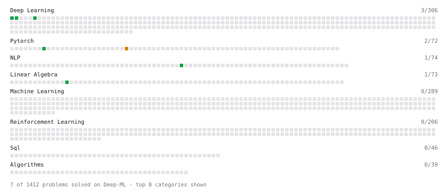

# Deep-ML

My machine learning practice from [Deep-ML](https://www.deep-ml.com). Every solution here was written by hand.

**17** solved · 17 problems · 0 labs · 0 math

[**Browse the interactive portfolio**](https://YifaSuoha962.github.io/deep-ml/) to replay this filling in over time.

## Problems

| | Difficulty | Solved | |
| --- | --- | --- | --- |
| [Build an MLP with nn.Sequential](https://www.deep-ml.com/problems/887) | easy | 2026-09-15 | [solution](problems/0887-build-an-mlp-with-nn-sequential) |
| [Calculate Cosine Similarity Between Vectors](https://www.deep-ml.com/problems/76) | easy | 2026-09-23 | [solution](problems/0076-calculate-cosine-similarity-between-vectors) |
| [Convert Vector to Diagonal Matrix](https://www.deep-ml.com/problems/35) | easy | 2026-09-18 | [solution](problems/0035-convert-vector-to-diagonal-matrix) |
| [Exact Match Benchmark Decontamination Check](https://www.deep-ml.com/problems/788) | easy | 2026-09-16 | [solution](problems/0788-exact-match-benchmark-decontamination-check) |
| [Implementation of Log Softmax Function](https://www.deep-ml.com/problems/39) | easy | 2026-09-16 | [solution](problems/0039-implementation-of-log-softmax-function) |
| [Sigmoid Activation Function Understanding](https://www.deep-ml.com/problems/22) | easy | 2026-09-16 | [solution](problems/0022-sigmoid-activation-function-understanding) |
| [Softmax Activation Function Implementation ](https://www.deep-ml.com/problems/23) | easy | 2026-09-16 | [solution](problems/0023-softmax-activation-function-implementation) |
| [Transformation Matrix from Basis B to C](https://www.deep-ml.com/problems/27) | easy | 2026-09-17 | [solution](problems/0027-transformation-matrix-from-basis-b-to-c) |
| [Binomial Distribution Probability](https://www.deep-ml.com/problems/79) | medium | 2026-09-18 | [solution](problems/0079-binomial-distribution-probability) |
| [BIRCH Clustering for Large Datasets](https://www.deep-ml.com/problems/825) | medium | 2026-09-20 | [solution](problems/0825-birch-clustering-for-large-datasets) |
| [Calculate Correlation Matrix](https://www.deep-ml.com/problems/37) | medium | 2026-09-20 | [solution](problems/0037-calculate-correlation-matrix) |
| [Numerically Stable Cross-Entropy](https://www.deep-ml.com/problems/914) | medium | 2026-09-16 | [solution](problems/0914-numerically-stable-cross-entropy) |
| [Omitted-Variable Bias](https://www.deep-ml.com/problems/1358) | medium | 2026-09-17 | [solution](problems/1358-omitted-variable-bias) |
| [Toy Models of Superposition: Feature Reconstruction](https://www.deep-ml.com/problems/862) | medium | 2026-09-18 | [solution](problems/0862-toy-models-of-superposition-feature-reconstruction) |
| [Overlapping Look-Back KV Compression](https://www.deep-ml.com/problems/760) | hard | 2026-09-19 | [solution](problems/0760-overlapping-look-back-kv-compression) |
| [SVD of a 2x2 Matrix](https://www.deep-ml.com/problems/28) | hard | 2026-09-19 | [solution](problems/0028-svd-of-a-2x2-matrix) |
| [Trade Compute for Memory with Gradient Checkpointing](https://www.deep-ml.com/problems/1342) | hard | 2026-09-23 | [solution](problems/1342-trade-compute-for-memory-with-gradient-checkpointing) |

---

_This file is regenerated by Deep-ML on every push._
