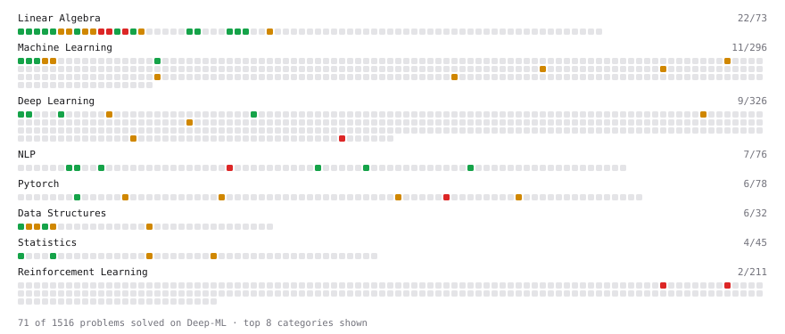

# Deep-ML

My machine learning practice from [Deep-ML](https://www.deep-ml.com). Every solution here was written by hand.

**59** solved · 57 problems · 2 labs · 0 math

[**Browse the interactive portfolio**](https://YifaSuoha962.github.io/deep-ml/) to replay this filling in over time.

## Problems

| | Difficulty | Solved | |
| --- | --- | --- | --- |
| [Build an MLP with nn.Sequential](https://www.deep-ml.com/problems/887) | easy | 2026-09-15 | [solution](problems/0887-build-an-mlp-with-nn-sequential) |
| [Calculate 2x2 Matrix Inverse](https://www.deep-ml.com/problems/8) | easy | 2026-08-11 | [solution](problems/0008-calculate-2x2-matrix-inverse) |
| [Calculate Cosine Similarity Between Vectors](https://www.deep-ml.com/problems/76) | easy | 2026-09-23 | [solution](problems/0076-calculate-cosine-similarity-between-vectors) |
| [Calculate Covariance Matrix](https://www.deep-ml.com/problems/10) | easy | 2026-08-18 | [solution](problems/0010-calculate-covariance-matrix) |
| [Calculate Mean by Row or Column](https://www.deep-ml.com/problems/4) | easy | 2026-08-11 | [solution](problems/0004-calculate-mean-by-row-or-column) |
| [Calculate Perplexity for Language Models](https://www.deep-ml.com/problems/320) | easy | 2026-09-05 | [solution](problems/0320-calculate-perplexity-for-language-models) |
| [Calculate Unigram Probability from Corpus](https://www.deep-ml.com/problems/129) | easy | 2026-09-27 | [solution](problems/0129-calculate-unigram-probability-from-corpus) |
| [Convert Vector to Diagonal Matrix](https://www.deep-ml.com/problems/35) | easy | 2026-09-18 | [solution](problems/0035-convert-vector-to-diagonal-matrix) |
| [Dot Product Calculator](https://www.deep-ml.com/problems/83) | easy | 2026-09-27 | [solution](problems/0083-dot-product-calculator) |
| [Empirical Probability Mass Function (PMF)](https://www.deep-ml.com/problems/184) | easy | 2026-08-21 | [solution](problems/0184-empirical-probability-mass-function-pmf) |
| [Exact Match Benchmark Decontamination Check](https://www.deep-ml.com/problems/788) | easy | 2026-09-16 | [solution](problems/0788-exact-match-benchmark-decontamination-check) |
| [Exact Match Score with Normalization](https://www.deep-ml.com/problems/325) | easy | 2026-09-27 | [solution](problems/0325-exact-match-score-with-normalization) |
| [Feature Scaling Implementation](https://www.deep-ml.com/problems/16) | easy | 2026-09-28 | [solution](problems/0016-feature-scaling-implementation) |
| [Implement Compressed Row Sparse Matrix (CSR) Format Conversion](https://www.deep-ml.com/problems/65) | easy | 2026-10-02 | [solution](problems/0065-implement-compressed-row-sparse-matrix-csr-format-conversion) |
| [Implement Orthogonal Projection of a Vector onto a Line](https://www.deep-ml.com/problems/66) | easy | 2026-10-02 | [solution](problems/0066-implement-orthogonal-projection-of-a-vector-onto-a-line) |
| [Implementation of Log Softmax Function](https://www.deep-ml.com/problems/39) | easy | 2026-09-16 | [solution](problems/0039-implementation-of-log-softmax-function) |
| [Laplace Smoothing for Bigram Probabilities](https://www.deep-ml.com/problems/987) | easy | 2026-09-04 | [solution](problems/0987-laplace-smoothing-for-bigram-probabilities) |
| [Linear Kernel Function](https://www.deep-ml.com/problems/45) | easy | 2026-09-27 | [solution](problems/0045-linear-kernel-function) |
| [Linear Regression Using Gradient Descent](https://www.deep-ml.com/problems/15) | easy | 2026-09-03 | [solution](problems/0015-linear-regression-using-gradient-descent) |
| [Linear Regression Using Normal Equation](https://www.deep-ml.com/problems/14) | easy | 2026-09-03 | [solution](problems/0014-linear-regression-using-normal-equation) |
| [Matrix-Vector Dot Product](https://www.deep-ml.com/problems/1) | easy | 2026-08-10 | [solution](problems/0001-matrix-vector-dot-product) |
| [Per-Token Decode Latency from Memory Bandwidth](https://www.deep-ml.com/problems/1214) | easy | 2026-08-21 | [solution](problems/1214-per-token-decode-latency-from-memory-bandwidth) |
| [Phi Transformation for Polynomial Features](https://www.deep-ml.com/problems/84) | easy | 2026-10-01 | [solution](problems/0084-phi-transformation-for-polynomial-features) |
| [Reshape Matrix](https://www.deep-ml.com/problems/3) | easy | 2026-08-11 | [solution](problems/0003-reshape-matrix) |
| [Scalar Multiplication of a Matrix](https://www.deep-ml.com/problems/5) | easy | 2026-08-11 | [solution](problems/0005-scalar-multiplication-of-a-matrix) |
| [Sigmoid Activation Function Understanding](https://www.deep-ml.com/problems/22) | easy | 2026-09-16 | [solution](problems/0022-sigmoid-activation-function-understanding) |
| [Simple Word Tokenizer Encode and Decode](https://www.deep-ml.com/problems/942) | easy | 2026-08-08 | [solution](problems/0942-simple-word-tokenizer-encode-and-decode) |
| [Softmax Activation Function Implementation ](https://www.deep-ml.com/problems/23) | easy | 2026-09-16 | [solution](problems/0023-softmax-activation-function-implementation) |
| [Transformation Matrix from Basis B to C](https://www.deep-ml.com/problems/27) | easy | 2026-09-17 | [solution](problems/0027-transformation-matrix-from-basis-b-to-c) |
| [Transpose of a Matrix](https://www.deep-ml.com/problems/2) | easy | 2026-08-11 | [solution](problems/0002-transpose-of-a-matrix) |
| [Binomial Distribution Probability](https://www.deep-ml.com/problems/79) | medium | 2026-09-18 | [solution](problems/0079-binomial-distribution-probability) |
| [BIRCH Clustering for Large Datasets](https://www.deep-ml.com/problems/825) | medium | 2026-09-20 | [solution](problems/0825-birch-clustering-for-large-datasets) |
| [Calculate Correlation Matrix](https://www.deep-ml.com/problems/37) | medium | 2026-09-20 | [solution](problems/0037-calculate-correlation-matrix) |
| [Calculate Eigenvalues of a Matrix](https://www.deep-ml.com/problems/6) | medium | 2026-08-10 | [solution](problems/0006-calculate-eigenvalues-of-a-matrix) |
| [Data-Efficient Action Mapping with Few Labeled Expert Samples](https://www.deep-ml.com/problems/728) | medium | 2026-08-31 | [solution](problems/0728-data-efficient-action-mapping-with-few-labeled-expert-samples) |
| [Diffusion Model U-Net Time Embedding](https://www.deep-ml.com/problems/399) | medium | 2026-09-26 | [solution](problems/0399-diffusion-model-u-net-time-embedding) |
| [Forward Diffusion Process](https://www.deep-ml.com/problems/303) | medium | 2026-09-26 | [solution](problems/0303-forward-diffusion-process) |
| [Implement BatchNorm2d from Scratch (training mode)](https://www.deep-ml.com/problems/902) | medium | 2026-09-07 | [solution](problems/0902-implement-batchnorm2d-from-scratch-training-mode) |
| [Implement K-Fold Cross-Validation](https://www.deep-ml.com/problems/18) | medium | 2026-08-10 | [solution](problems/0018-implement-k-fold-cross-validation) |
| [Implement Self-Attention Mechanism](https://www.deep-ml.com/problems/53) | medium | 2026-09-04 | [solution](problems/0053-implement-self-attention-mechanism) |
| [K-Means Clustering](https://www.deep-ml.com/problems/17) | medium | 2026-08-10 | [solution](problems/0017-k-means-clustering) |
| [Matrix times Matrix ](https://www.deep-ml.com/problems/9) | medium | 2026-08-31 | [solution](problems/0009-matrix-times-matrix) |
| [Matrix Transformation ](https://www.deep-ml.com/problems/7) | medium | 2026-08-31 | [solution](problems/0007-matrix-transformation) |
| [Numerical Gradient Checking](https://www.deep-ml.com/problems/313) | medium | 2026-08-30 | [solution](problems/0313-numerical-gradient-checking) |
| [Numerically Stable Cross-Entropy](https://www.deep-ml.com/problems/914) | medium | 2026-09-16 | [solution](problems/0914-numerically-stable-cross-entropy) |
| [Omitted-Variable Bias](https://www.deep-ml.com/problems/1358) | medium | 2026-09-17 | [solution](problems/1358-omitted-variable-bias) |
| [Poisson Deviance and Overdispersion](https://www.deep-ml.com/problems/1367) | medium | 2026-10-01 | [solution](problems/1367-poisson-deviance-and-overdispersion) |
| [SGD with Momentum Step](https://www.deep-ml.com/problems/1235) | medium | 2026-10-01 | [solution](problems/1235-sgd-with-momentum-step) |
| [Solve Linear Equations using Jacobi Method](https://www.deep-ml.com/problems/11) | medium | 2026-09-05 | [solution](problems/0011-solve-linear-equations-using-jacobi-method) |
| [Thread-Safe Producer-Consumer Bounded Buffer](https://www.deep-ml.com/problems/1100) | medium | 2026-09-02 | [solution](problems/1100-thread-safe-producer-consumer-bounded-buffer) |
| [Toy Models of Superposition: Feature Reconstruction](https://www.deep-ml.com/problems/862) | medium | 2026-09-18 | [solution](problems/0862-toy-models-of-superposition-feature-reconstruction) |
| [Determinant of a 4x4 Matrix using Laplace's Expansion (hard)](https://www.deep-ml.com/problems/13) | hard | 2026-09-04 | [solution](problems/0013-determinant-of-a-4x4-matrix-using-laplace-s-expansion-hard) |
| [Differential Sarsa Algorithm](https://www.deep-ml.com/problems/541) | hard | 2026-08-18 | [solution](problems/0541-differential-sarsa-algorithm) |
| [Overlapping Look-Back KV Compression](https://www.deep-ml.com/problems/760) | hard | 2026-09-19 | [solution](problems/0760-overlapping-look-back-kv-compression) |
| [SVD of a 2x2 Matrix](https://www.deep-ml.com/problems/28) | hard | 2026-09-19 | [solution](problems/0028-svd-of-a-2x2-matrix) |
| [Trade Compute for Memory with Gradient Checkpointing](https://www.deep-ml.com/problems/1342) | hard | 2026-09-23 | [solution](problems/1342-trade-compute-for-memory-with-gradient-checkpointing) |
| [Weisfeiler-Lehman Color Refinement and the 1-WL Test](https://www.deep-ml.com/problems/1481) | hard | 2026-10-01 | [solution](problems/1481-weisfeiler-lehman-color-refinement-and-the-1-wl-test) |

## Labs

| | Difficulty | Solved | |
| --- | --- | --- | --- |
| [MNIST: Pytorch DataLoader](https://www.deep-ml.com/labs/1) | medium | 2026-08-08 | [solution](labs/0001-mnist-pytorch-dataloader) |
| [Train a Tabular Policy with DPO](https://www.deep-ml.com/labs/37) | medium | 2026-08-11 | [solution](labs/0037-train-a-tabular-policy-with-dpo) |

---

_This file is regenerated by Deep-ML on every push._
