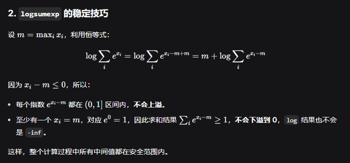

### 2026/9/16

**Softmax Activation Function Implementation 中的stability技巧不熟。**
- logits - logits.max(dim=-1, keepdim=True) 让exp后的上界变小，因此防止上溢出。

**Numerically Stable Cross-Entropy 中的gather技巧不熟。**
- 在计算交叉熵时要对softmax取log，用上面的stability技巧后，softmax的输出可能会有0.0的情况，这样log(0.0)就会变成-inf，导致梯度爆炸。优化方案是直接调torch.logsumexp

- gather时关注两个要素，一是dim，二是index和原始数据的对齐关系：dim表示沿着哪个维度取值，index要在取数的dim上和原始tensor对齐。

### 2026/9/17

**Solving linear square systems, 对linalg.lstsq()的输出结果不熟。**
[numpy-api文档](https://numpy.com.cn/doc/stable/reference/generated/numpy.linalg.lstsq.html); [torch-api文档](https://docs.pytorch.org/docs/stable/generated/torch.linalg.lstsq.html).

