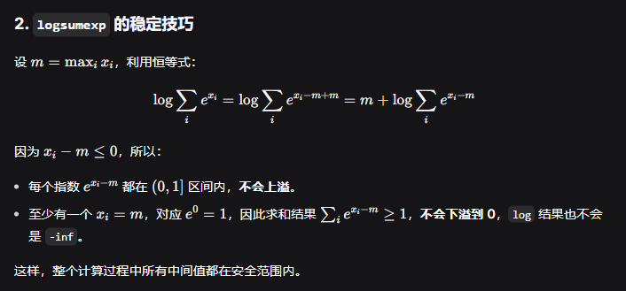

### 2026/9/16

**Softmax Activation Function Implementation 中的stability技巧不熟。**
- logits - logits.max(dim=-1, keepdim=True) 让exp后的上界变小，因此防止上溢出。

**Numerically Stable Cross-Entropy 中的gather技巧不熟。**
- 在计算交叉熵时要对softmax取log，用上面的stability技巧后，softmax的输出可能会有0.0的情况，这样log(0.0)就会变成-inf，导致梯度爆炸。优化方案是直接调torch.logsumexp

- gather时关注两个要素，一是dim，二是index和原始数据的对齐关系：dim表示沿着哪个维度取值，index要在取数的dim上和原始tensor对齐。

------
### 2026/9/17

**Solving linear square systems, 对linalg.lstsq()的输出结果不熟。**
[numpy-api文档](https://numpy.com.cn/doc/stable/reference/generated/numpy.linalg.lstsq.html); [torch-api文档](https://docs.pytorch.org/docs/stable/generated/torch.linalg.lstsq.html).

------
### 2026/9/18

**多维特征加和的维度广播问题**
- 为什么X(batch, feature) + W(feature,)不需要对W手动扩充维度(unsqueeze.(0))？
- 而(B,) 不能直接和 (B,C,H,W) 相加，需要进行维度对齐？

这涉及到**PyTorch Broadcasting 规则**

PyTorch 广播时，**会从最后一个维度开始向前比较**两个 tensor 的 shape。每一维只要满足下面任意一个条件，就可以广播：

1. 两个维度相等；
2. 其中一个维度是 1；
3. 某个 tensor 在这一维根本不存在，可以视为补了一个 1。

Case 1符合该原则，而Case 2不符合该原则，因此需要手动扩充维度。

**torch.distributions 使用规则**
torch没给出直接计算概率的api，都是用log_prob()，然后再exp()得到概率。因为概率值通常很小，直接计算概率容易下溢出，而log_prob()的输出是对数值，通常不会下溢出。

samle() 是从分布中采样，得到样本的期望。
[torch.distributions文档](https://docs.pytorch.org/docs/2.14/distributions.html)

### 2026/10/1
WL-test 使用ai 写的，自己要重新实现一遍。注意事项：

第一，wl_refine 中每个节点的新颜色不是随便编号，而是要把所有不同 signature 排序后，按排序位置统一编号，这样结果是确定的。

第二，wl_test 必须在两个图的 disjoint union 上联合 refinement，否则两个图如果分别编号，颜色标签本身没有可比性。

注意这里 rounds 不是“总共调用了几次 wl_refine”，而是：
有多少轮真正增加了颜色类别数量。

因此虽然实际上做了第 3 次 refinement 才发现稳定，但第 3 轮不计入 rounds。
color_histogram 例如：
print(color_histogram([0, 1, 2, 1, 0]))

得到：
[1, 2, 2]

因为颜色类大小分别是：
color 0: 2 nodes
color 1: 2 nodes
color 2: 1 node

排序后就是：
[1, 2, 2]

而 wl_test 之所以必须联合跑，是因为如果两个图分别 refinement：
colors_graph1 = [0, 1, 2]colors_graph2 = [0, 1, 2]

这里的 0/1/2 只是各自图内部的编号，不一定代表相同 signature。
放到 disjoint union 后：
union = graph1 + graph2

所有节点共享同一个：
signature_to_color

此时同一个整数颜色才真正表示：
两边节点具有相同的 WL signature。

这正是题目提示里 “Refining the two graphs jointly is what makes their colours comparable” 的含义。